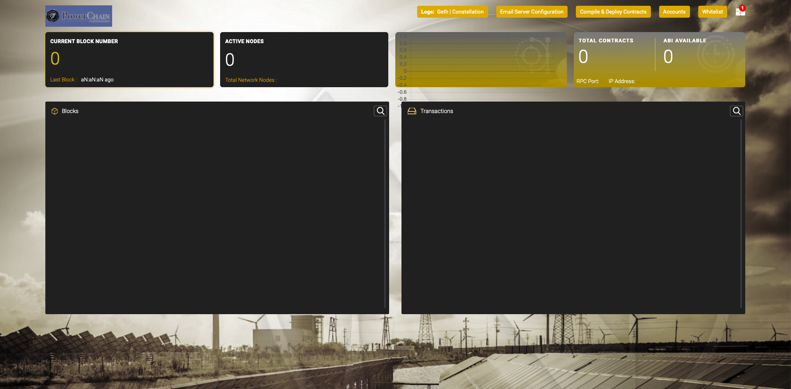

# PowerChain Maker UI (development)

Utility to create and monitor Nordic Energy´s PowerChain. This project was generated with [Angular CLI](https://github.com/angular/angular-cli) version 1.7.4.

### Development server

Run `ng serve` for a dev server. Navigate to `http://localhost:4200/`. The app will automatically reload if you change any of the source files.

### Code scaffolding

Run `ng generate component component-name` to generate a new component. You can also use `ng generate directive|pipe|service|class|guard|interface|enum|module`.

### Build

Run `ng build` to build the project. The build artifacts will be stored in the `dist/` directory. Use the `-prod` flag for a production build.

### Running unit tests

Run `ng test` to execute the unit tests via [Karma](https://karma-runner.github.io).

### Running end-to-end tests

Run `ng e2e` to execute the end-to-end tests via [Protractor](http://www.protractortest.org/).

### Further help

To get more help on the Angular CLI use `ng help` or go check out the [Angular CLI README](https://github.com/angular/angular-cli/blob/master/README.md).

### ⭐️ Show your support
Please ⭐️ this repository if this project helped you!

#### Donation
If you like this project, feel free to donate:
* Bitcoin:  14GyqCEZXyeythb6B6Vu5DiBCMszFrBsp1
* Litecoin: LSi7smGjLwAmihFLEtV7Lit9Mmbsds9Tin
* Ripple: rE5DbPTbtYT6tKqfXMD8352tTpdNvFydxb
* Tron: TFSx6BBFNdxXoJJrTEWGEekTmb1AwNEEca
* Ethereum: 0x0A6f46F29e047EdcFdf7BF67fD1DcC418100beea
* DAI: 0x3FcDF18672dF7079E3146C87502003fb7dB4fa38
* Paypal: paypal.me/nordicenergy
